# Torus-hyperBFT — Architecture, Consensus, and Performance Review

**Scope & method.** Seven agents read the code in parallel (consensus engine, node/app/bridge wiring, EVM/state, mempool/network/RPC, a config-knob sweep, a docs/history miner, and a deliberately *doc-blind* adversarial reviewer). Findings are **code-first**; the project's own docs/PRPs are used only as a cross-check at the end. The one load-bearing safety claim was verified directly against source. Two independent agents disagreed on the locking rule — `invariants.rs` was read directly to settle it (the adversarial reviewer was correct).

**One-line verdict.** The engineering is serious and unusually well-instrumented — a MonadBFT-style fork of ParallelChain `hotstuff_rs` with header-first pipelining, commit-then-execute, and a hardened native-DA layer. But there is a **confirmed design-level consensus-safety defect** (locking rule left at 3-chain depth while the commit rule was reduced to 2-chain), and the working tree is currently on has the **S430 livelock fix disabled by a diagnostic kill-switch**. Both are detailed below.

---

## 1. Architecture map

### Crate dependency graph (built from the Cargo manifests)

```mermaid
graph TD
    node[torus-node<br/>CLI entrypoint / wiring] --> consensus[torus-consensus<br/>App layer: produce/validate/commit]
    node --> network[torus-network<br/>libp2p QUIC/gossip]
    node --> rpc[torus-rpc<br/>JSON-RPC]
    node --> genesis[torus-genesis]
    consensus --> hs[hotstuff_rs<br/>BFT engine]
    consensus --> bridge[torus-bridge<br/>block build/validate/commit]
    consensus --> mempool[torus-mempool]
    consensus --> evm[torus-evm<br/>revm Cancun]
    consensus --> econ[torus-economics]
    bridge --> evm
    bridge --> state[torus-state<br/>RocksDB + tries]
    bridge --> econ
    network --> hs
    evm --> state
    evm --> core[torus-core<br/>CLOB / precompiles]
    mempool --> state
    econ --> state
    state --> types[torus-types]
    hs -.KVStore trait.-> state
    subgraph telemetry
      tel[torus-telemetry — Prometheus]
    end
```



**Responsibilities & the two seams that matter:**
- **`torus-node`** (`crates/torus-node/src/main.rs`) is the composition root — ~950 lines of `run()` wiring channels between subsystems and spawning the threads.
- **`hotstuff_rs`** is a **generic, app-agnostic** BFT engine. It talks to the app through a trait and to the world through a `Network` trait and a `KVStore` trait.
- **`torus-consensus`** (`crates/torus-consensus/src/app.rs`, 3,465 lines) is the *only* crate that bridges the two: it implements `hotstuff_rs::App` for Torus. This is where "consensus" meets "EVM+CLOB."
- **`torus-bridge`** holds the block build/validate/commit/state-root mechanics; **`torus-core`** holds the CLOB matching engine and the cross-VM precompiles; **`torus-state`** owns RocksDB (41 column families) and the trie implementations.

### Entry point & runtime topology (`main.rs`)

`run()` (main.rs:339-864) loads keys/genesis, opens `StateDb`, constructs `TorusApp` (which itself spawns the execution thread), and starts the HotStuff replica via `ReplicaSpec::builder()`. The threads/tasks and the channels between them are the key to understanding the system:

| Thread / task | Purpose | Channel in |
|---|---|---|
| HotStuff `Algorithm` loop | single-threaded consensus event loop | owns the block tree |
| **`torus-execution` thread** | EVM + CLOB execution, post-commit | `sync_channel(64)` (app.rs:1057) |
| `DaRecoveryWorker` thread | off-consensus-thread body recovery | `sync_channel(8)` (app.rs:833) |
| RPC (own 4-worker tokio runtime, own OS thread) | isolate user load from consensus (main.rs:732-753) | — |
| pre-proposal push thread | body dissemination | `sync_channel(4)` |
| gossip/forward ingest tasks | mempool feed | bounded 8192 (native) / **unbounded** (EVM) |

**The single most important structural fact:** this is a **commit-then-execute (CTE)** chain. `produce_block` and `validate_block` do **no execution** — the block header carries the *parent's* state root, and real execution happens after commit on the dedicated execution thread (app.rs:1-16, 542-548). Consensus agrees on ordering; state agreement rests entirely on deterministic replay. Everything about performance and several of the risks below flow from this choice.

---

## 2. Core consensus flow (traced through code)

The engine is a **2-chain MonadBFT variant** with header-first "hybrid pipelining." Terminology: **PC = PhaseCertificate** (the QC type); phases are Generic/Prepare/Precommit/Commit/Decide, with Generic on the happy path.

**Steady-state happy path (≈2 network steps per block, fully pipelined):**

1. **Leader enters view** → `enter_view` (hotstuff/implementation.rs:215-516). If it's proposer and `highest_pc.phase ∈ {Generic,Decide}`, it calls **`app.produce_block`** (:443-454), builds `Block::new(...)`, self-inserts, and **broadcasts only a `ProposalHeader`** (:526-538). The body is stashed and served out-of-band.
2. **Replicas vote on the header** → `on_receive_proposal_header` (:1579-1763) verifies the block hash + `justify.is_correct`, then **votes immediately** (:1714-1728) and only *afterwards* requests the body (`BlockDataRequest`, :1739). Votes go point-to-point to the leader of view+1.
3. **Next leader forms the PC** → `on_receive_phase_vote` (:1157-1269) collects a quorum (`ceil(2/3·power)+1`), then broadcasts `AdvanceView(PC)` (:1257) and proposes the next block. The AdvanceView overlaps the next proposal, so cadence ≈ **1 RTT/block**.
4. **Commit** → `block_to_commit` (block_tree/invariants.rs:518-555): commit the grandparent when two QCs land in **consecutive views** (`justify.view == parent_justify.view + 1`). Speculative 1-QC commit fires earlier (implementation.rs:1237-1243); irrevocable at 2 consecutive QCs. `BlockTreeSingleton::update` → `commit()` invokes **`app.on_committed_block`** synchronously, which hands the block to the execution thread.

**Body arrival** (`try_insert_body`, :1830-1891) runs `app.validate_block` and inserts; parentless bodies park in `deferred_bodies`.

**Pacemaker / view change** (`pacemaker/implementation.rs`): absolute per-epoch deadline schedule, `max_view_time = 500ms`, **no exponential backoff**. On timeout every view broadcasts a `TimeoutVote`; Bracha amplification (>f votes → you also vote) speeds convergence; a TC triggers `AdvanceView(TimeoutCertificate)`. Tail-fork protection via reproposal + **No-Endorsement Certificates** (2f+1 non-voter signatures prove no QC could exist, licensing a fresh proposal).

**Block sync** (`block_sync/`): height-range catch-up on its own thread, plus — from the livelock work — **by-hash justify recovery** and **gap-tolerant sync serve** (commit c938d92).

**Key data structures:** `PhaseCertificate {chain_id, view, block, phase, signatures}` (types.rs:33); `TimeoutCertificate` adds `high_tip`/`high_qc`/`high_tip_is_winner`; `BlockTreeSingleton` is the sole mutable owner of ~23 persisted safety variables (`LOCKED_PC`, `HIGHEST_PC`, `LOCAL_TIP`, `LAST_VOTED_PROPOSAL`, `SPECULATIVE_COMMITS`, …), living on the algorithm thread with **no locks** — concurrent readers use KV snapshots (`BlockTreeCamera`). Clean design.

---

## 3. Critical pass — ranked

### 🔴 C1. Locking rule is 3-chain depth but the commit rule is 2-chain → conflicting blocks can both commit *(CONFIRMED against code — verified directly)*

`block_to_commit` (invariants.rs:518-555) commits the grandparent on two consecutive-view QCs (2-chain). But `pc_to_lock` for `Phase::Generic` (invariants.rs:433-437) still returns `justify.block.justify` — **lock-on-grandparent**, the *original 3-chain* depth — and `extends_locked_pc_block` (invariants.rs:631-633) allows a certificate through if it extends the locked block within **three** generations. The in-code comment (invariants.rs:511-517) explicitly asserts "lock-on-grandparent provides sufficient safety for 2-chain commit." **That reasoning is wrong.**

Concretely, for chain `G ← P ← B` (all Generic): when the quorum votes for `B`, it processes `B.justify = QC_P` and locks on `QC_P.block.justify = QC_G` — i.e. it locks on **G, not P**. The moment `QC_B` forms, `P` becomes committable — but the voting quorum is still locked only on `G`. A conflicting sibling `P'` (another child of `G`, `justify = QC_G`) proposed at a higher view passes `safe_pc` predicate 3 because it *extends the locked block G*. So the same quorum votes for `P'`, `QC_P'` forms, and a 2-chain on that branch commits `P'`. **Both `P` and `P'` commit — an agreement violation.** In correct 2-chain BFT (Jolteon / HotStuff-2), voting for `B` must lock on `P`; the code locks one generation too shallow. The fix is `pc_to_lock(Generic)` returning `justify` itself.

Severity context: reachable under a partial-synchrony adversary with an equivocating/withholding leader. It is *masked today* only because the live fleet runs **3 validators with 3-of-3 quorum** (zero fault tolerance) — but the project's stated plan is to add a 4th validator to get `f=1`, which is exactly when this becomes fully exploitable. This deserves a written safety proof or a model-checker run before any validator-set growth. It needs a runtime PoC to be nailed shut, but the static case is solid.

### 🔴 C2. The livelock fix on this branch is currently disabled by a diagnostic kill-switch *(CONFIRMED)*

The uncommitted change in `hotstuff/implementation.rs` adds `request_missing_parent` (the S430 "header-first body starvation" fix), but wraps it in:
```rust
// TEMP-DIAGNOSTIC (S430 A/B): neutralize to isolate regression cause. REMOVE.
if justify_view.int() != u64::MAX { return; }
```
Since `justify_view` is never `u64::MAX`, **the parent-fetch fix is a no-op in this working tree** — an A/B bisection state. In this state a body-starved validator that becomes leader burns a full view timeout on every leader slot (the `parent_body_starvation_test` scenario; ~84% failure under 8-way load per the sprint notes). This is the single most important thing to know about the current checkout, and the `REMOVE` marker is a live reminder that it must be deleted before merge.

### 🟠 C3. Header-first pipeline relaxes classical HotStuff invariants *(CONFIRMED; compounds C1)*
- **Vote-before-validate:** replicas vote on a header *before* `app.validate_block` runs (validation happens only when the body arrives). A QC can form over an app-invalid block. It can never *commit* (can't be inserted), but `highest_pc` will point at it — a liveness hazard by design.
- **`safe_pc` bypass for pending blocks:** `on_receive_proposal_header` skips the lock-safety predicate entirely when the justify's block is already tracked as pending (implementation.rs:1653-1667). "Previously seen as a header" is not evidence the justify satisfies the current lock — this widens the C1 window on the fast path.
- **Sync commits skip the safety check** (block_sync/client.rs:258-311): synced blocks are validated with `is_correct` (signatures) only; `safe_block`/`safe_pc` are intentionally skipped, then `update()` *commits*. A single Byzantine sync-server can feed a lagging node a QC-valid branch that conflicts with its lock. Independent weaker trust model, and a direct amplifier of C1.

### 🟠 C4. Vote is sent on the wire *before* the vote state is persisted *(CONFIRMED ordering; exploit needs runtime check)*
implementation.rs:972 (`send`) precedes :976 (`set_vote_state_atomic`); same on the header path (:1727 before :1730). A crash between send and persist loses the `highest_view_voted` update, so on restart the node can vote a *second* time in the same view → cross-crash equivocation. Should be persist-then-send, and durability depends on the pluggable `KVStore` fsync behavior (not enforced here).

### 🟠 C5. Writer precompiles bypass the revm journal → non-revertible state + blocks parallel execution *(CONFIRMED)*
Torus cross-VM precompiles (`torus-core/src/precompiles.rs:270-276`; CoreWriter enqueue at :1007, order-book writes at :1382) mutate RocksDB **directly during EVM execution**. If an EVM tx calls CoreWriter and then reverts, the durable write survives — revm's journal can't undo it. `execute_block`'s doc claim "without modifying the underlying database" (executor.rs:79-81) is false for these. This is also blocker #1 for any Block-STM-style parallel execution.

### 🟠 C6. Zombie mode: a matching-engine panic kills execution while consensus keeps finalizing *(CONFIRMED)*
`market_workers.rs:77` does `h.join().expect("market worker panicked")`. A panic in one market's matching thread kills the execution thread; consensus then keeps advancing height while every commit logs "execution pipeline channel closed — block will not be executed!" (app.rs:2071-2074). Height advances, state freezes — the worst failure mode for a chain. Combined with pervasive `.lock().unwrap()`/`.write().unwrap()` on the swarm and mempool paths, lock-poisoning is a realistic trigger.

### 🟡 C7. Latent crash-recovery bug when pruning is enabled *(CONFIRMED)*
`find_last_committed_height` (app.rs:156-167) reads only the last key of `cf_block_headers`, but the pruner stores its progress meta key in the *same* CF (pruner.rs:78) and it sorts after all realistic height keys. Once pruning has run, the function returns `None` and crash-recovery replay (app.rs:1169) is silently skipped.

### 🟡 C8. Reputation-weighted leader selection would livelock if enabled *(CONFIRMED; latent — kill-switched off)*
Reputation is accumulated from *locally-observed* successes/timeouts (internal.rs:1759), which aren't totally ordered across replicas. Divergent maps → divergent leader choice → no quorum → permanent livelock. It's correctly disabled behind a global `AtomicBool` (pacemaker/implementation.rs:905-927), but the process-global switch is a footgun and the hot path is already threaded for it. Keep off until reputation derives from committed chain data.

### 🟡 C9. Unbounded, attacker-influenced queues *(CONFIRMED)*
Inbound EVM-tx and native-action channels (network bridge.rs:185-186) and all RPC→leader forward channels (main.rs:719-720) are **unbounded**; the swarm's `block_store` never evicts (swarm.rs:245); `ne_sent_views` grows one entry per view forever (implementation.rs:90/1475); `TxSubmitLimiter` never prunes senders. A gossip/forward flood inflates memory before the serial verifier (below) can shed it.

### 🟡 C10. `serde_json` on consensus-critical and hot persistence paths *(CONFIRMED)*
`receipts_root = keccak(serde_json(receipts))` (proposer.rs:302-310) makes consensus depend on serde_json byte-stability; headers, bodies, and receipts are all JSON-persisted (committer.rs:97-115; app.rs:503-507), 2-3× byte inflation on 6MB bodies. The header hashing already got a canonical-bytes fix; the receipts root did not. Move to RLP/bincode.

**Also noted (lower):** `BlockHeight` subtraction can panic/wrap on a stale peer advertisement (client.rs:555); `attestation_digest` uses `bincode::serialize(...).unwrap_or_default()` so a serialize failure silently hashes nothing (proposer.rs:341); `NativeStateOverlay` allocates `(String, Vec<u8>)` and takes an RwLock on *every* native read; oversized units (app.rs 3,465 lines; native_executor.rs 2,126).

---

## 4. Performance deep-dive

**Framing correction, straight from the project's own measurements** (this reorders the priorities you'd guess from reading the code): the code *looks* execution-bound — the execution thread's queue gauge is documented as "pinned near 64 = execution is the bottleneck" (app.rs:531-534). But the `exec-ceiling` sprint **instrumented it and refuted that**: `exec_queue_depth` was **0 at every sample**, the exec thread was ~90% idle, and a later re-profile (`ingress-cpu-supply.md`) showed the real per-action crypto cost is **~5.8ms**, not the 70ms seen live — the inflation was **CPU starvation from other processes on the box** (a 100%-pinned MCP gateway, concurrent Claude sessions). On paper there's ~345k orders/s of ingress headroom; measured was ~14/s. **A large fraction of the "throughput problem" is environmental scheduling, not code.** Any benchmark must run on an isolated box (`taskset`/cpuset) before drawing code conclusions.

With that caveat, here are the genuine code-level bottlenecks per axis.

### (a) Blockspeed — time-to-commit

**Where the time goes:** cadence is purely RTT-bound — **there is no minimum block interval or pacing sleep anywhere** (verified in the knob sweep). Steady state ≈ 1 RTT/block; irrevocable commit ≈ 2 RTT. Local floor is ~102ms empty (per S395 report); WAN legs are genuine 227-502ms RTT. The non-RTT overhead is small ticks: a 250µs poller park (receiving.rs:72), the once-per-block KV reads for `highest_pc`/`validator_set_state` (deserialized 2-3× per tick), and — historically — a `select_leader` that was **O(view)** and caused "height drag" (fixed to closed-form in S405).

**Ranked improvements:**
1. **Delete the C2 kill-switch and land the S430 parent-fetch fix** — effort trivial, impact high (eliminates the ~500ms view-timeout burns on body-starved leaders). No safety tradeoff; it only adds a fetch. *Do this first.*
2. **`highest_pc` / `validator_set_state` read caching on the algorithm tick** — the `leader-rep-kv-cache` PRP targets ~11 KV round-trips/block. Low risk (write-through, determinism-gated), modest latency win at the empty-block floor.
3. **Adaptive timeout / backoff** — `timeout_max_ms` is parsed from genesis but **dead** (never wired); there is *no* backoff at all. Under repeated partition this risks view thrash. Adding exponential backoff is a liveness improvement, but tune carefully against the header-first relaxations (C3).
4. **Speculative block production** (the `speculative-pipelining` PRP, unshipped) — next leader pre-builds during voting; ~15→10ms effective. Higher complexity; interacts with the speculative-commit/rollback machinery — needs the C1/C3 safety questions resolved first.

**Safety flag:** the `TARGET_BLOCK_TIME_SECS = 2` assumption in economics (types.rs:310) is enforced *nowhere* — at ~289ms real cadence, unbonding/jail/governance windows silently run ~7× faster in wall-clock time. That's an economic-safety bug, not a speed one, but it's coupled to blockspeed.

### (b) Orders/s

**Design intent (correct):** *few, huge, signed batches* — `PlaceOrderBatch` costs **one ecrecover per 1024 orders** (the O2 keystone), proposals ship hash-only, bodies move via manifest+pull with zstd. Measured lift from batching was **~38× (293 → 11,213 orders/s)**; bs100 baseline is 23,430 orders/s at 289ms blocks.

**Ranked code-level chokepoints:**
1. **Serial ecrecover on every gossiped action** (main.rs:513-526 → mempool lib.rs:385): one tokio task doing a full secp256k1 recover per action, sequentially, on the consensus/libp2p runtime. Hard **~10k actions/s single-core ceiling** per validator. *Fix:* verify on the ingress rayon pool (parallel batch), or admit trusted + rely on the exec-side verify-and-slash machinery that already exists (app.rs:337). Medium effort, high impact, **no safety tradeoff** (slash backstop already there).
2. **Native pool full sort + hash-index rebuild under the write lock, every `produce_block`** (native_pool.rs:283-295): O(n log n) over ≤65,536 entries on the proposer's critical path while RPC/gossip inserts block on the same lock. *Fix:* maintain a sorted `BTreeMap` index incrementally; snapshot-select outside the lock. Medium effort, high impact, no consensus tradeoff (proposer-local).
3. **`NATIVE_TOTAL_BLOCK_CAP = 100` actions/block** — with unbatched senders this alone caps ~300 orders/s. Env-overridable (`TORUS_NATIVE_TOTAL_BLOCK_CAP`); S387 probe showed cap=1000 no longer wedges now that manifest+pull is hardened. *Raising this is the single biggest lever for many-sender workloads* — but it's the **WAN dissemination guard**, so raise it together with the DA/erasure-coding work, not alone (that's the historical bs1000 wedge).
4. **Per-action RocksDB DA `put` on the RPC ingress path** (mempool lib.rs:604) — the proposer path was batched into one WriteBatch; ingress wasn't. Batch it (~50ms accumulation). Low effort.
5. **The canonical-identity tax** — even the bincode endpoint re-serializes each action to `serde_json` for the keccak action-hash (torus.rs:298). Cache the bytes. Low effort.

**Existing knobs:** `TORUS_NATIVE_ORDERS_PER_BLOCK_CAP` (50k), `TORUS_NATIVE_BLOCK_BYTES_CAP` (6MB), `TORUS_HASH_ONLY_PUSH_THRESHOLD` (512KB, and the O5 sweep proved 512KB manifest+pull **beats** 3MB full-push 11.4k vs 0.5-4.5k o/s — leave it low), `SUBMIT_PERMITS` (64), `VERIFIED_SENDER_CACHE_CAP` (16,384 — **note:** sized against cap=100; raising the block cap without resizing this thrashes the trust cache).

### (c) tEVM tx/s

**Where the time goes (biggest structural cost = state-root work):** the state root is computed **up to three times per EVM block** on the live path — once in `validate_block_for_catchup` and thrown away (state_root.rs:43), once at commit (incremental.rs:359), and once more in `resync_evm_accounts` for native fee credits (app.rs:470) — plus native trie maintenance. With the incremental flag *off* (or the oracle on), each site is an **O(total-state) full scan** (state_root.rs:172-260) that cannot hold a sub-100ms cadence at scale.

**Ranked improvements:**
1. **Compute the root once per block** — plumb the first computation's `TrieUpdates` into the commit instead of discarding them, and skip the root entirely in `validate_block_for_catchup` when `skip_state_root_check` is set (it's only fed to a histogram there). Low effort, high impact, no correctness risk. *The cheapest big EVM win.*
2. **Cross-block warm state cache** — revm's `State` cache dies each block, so hot accounts (a popular ERC-20) re-read RocksDB every block through per-slot point-gets (db.rs:379-399). A shared moka/LRU over `basic_ref/storage_ref/code_by_hash_ref`, invalidated from the commit bundle, is cheap and high-yield.
3. **Keep `TORUS_INCREMENTAL_STATE_ROOT` on and the oracle off in production** — the A1.6 proof is decisive: **3.19ms at 1M accounts vs 6.98s full-scan**. The oracle costs 350-503ms/block; it belongs in CI, not the fleet.
4. **Block-STM-style parallel execution — expensive, gated.** The executor shape is *almost* ready (`StateDb: DatabaseRef` is `&self`), but it's blocked by **C5** (writer precompiles do non-journaled, order-dependent RocksDB side effects), by reader precompiles spanning native CFs, and by beneficiary hot-spotting. Only pays off once the 5M gas budget is raised toward the 30M limit. Do the cheap wins (1-3) and binary serialization first — far more tx/s per engineering hour.

**Existing knobs:** `TORUS_EVM_BLOCK_GAS_BUDGET` (5M selection budget vs 30M block limit — deliberate ceiling), `TORUS_EVM_SENDER_SHARE_PCT` (25%), RocksDB cache/memtable are compiled-in (256MiB/128MiB) and **not** env-tunable — worth exposing.

---

## 5. Where to start reading

1. **`crates/torus-consensus/src/app.rs`** — the whole system in one file: `produce_block` (:1592), `validate_block` (:1760), `on_committed_block` (:1961), `execute_committed_block` (:190). Read this first; CTE is the key idea.
2. **`crates/hotstuff_rs/src/block_tree/invariants.rs`** — `safe_pc`, `pc_to_lock`, `block_to_commit` (:320-584). The safety core, and where finding C1 lives.
3. **`crates/hotstuff_rs/src/hotstuff/implementation.rs`** — `enter_view` (:215), `on_receive_proposal_header` (:1579), `on_receive_phase_vote` (:1157), and the uncommitted `request_missing_parent` (:2045) with its C2 kill-switch.
4. **`crates/torus-bridge/src/state_root.rs`** + **`crates/torus-state/src/incremental.rs`** — the triple-root cost.
5. **Docs for intent:** `docs/plans/blockspeed-orders-roadmap-s405.md` (live roadmap), `docs/reports/sprint-s395-report.md` (richest single doc), `docs/plans/exec-ceiling-verdict.md` + `ingress-cpu-supply.md` (where the bottleneck *actually* landed).

---

## 6. Cross-check against the project's own notes

The code findings hold up, and in several cases the project already knows: the **3-of-3 quorum fragility** and an **epoch-boundary quorum off-by-one** (chain mechanically halts within 100 views of losing any validator) are documented; the "execution is the bottleneck" theory was refuted by their own instrumentation; manifest+pull-beats-full-push and the 512KB threshold were empirically settled. Two things the docs *don't* flag that the code review surfaces: **C1 (the 2-chain/3-chain lock mismatch)** — the doc-blind reviewer found it precisely *because* it ignored the docs' safety narrative — and the fact that **C2 has left the current branch's livelock fix disabled**. There's also a standing instruction in their notes: *do not change the validator set on the fleet-pinned binaries* until the wrong-set-PC fix (771b063) ships — which dovetails with C1's "don't grow past 3 validators yet."

---

## Appendix A — Consensus timing model

**Protocol shape.** Pipelined chained-HotStuff with MonadBFT modifications (speculative commits, optional reputation leaders, Bracha timeout amplification). One block per view, `Phase::Generic` on the happy path.

**Per-block critical path (happy path, view v):**
1. Leader L(v) broadcasts hash-only `Proposal(v)` (`COMPACT_PROPOSALS = true`, app.rs:664) → **0.5 RTT**
2. Replicas validate + send `PhaseVote` to leader of view v+1 → **0.5 RTT**
3. L(v+1) collects quorum → PC(v), broadcasts `AdvanceView(PC)`, proposes Block(v+1). AdvanceView overlaps next proposal → steady-state ≈ **1 RTT/block**. **No minimum block interval / pacing delay anywhere.**

**Commit latency:** speculative (1-QC) ≈ 1 RTT after proposal; irrevocable (2-chain, consecutive views) ≈ 2 RTT.

**View timeout / pacemaker:** `max_view_time` = genesis `timeout_base_ms`, default **500 ms** (main.rs:610). Absolute per-epoch deadline schedule; **no exponential backoff** (`timeout_max_ms` parsed but dead). Epoch length 100 views (devnet/testnet). Leader schedule: Interleaved Weighted Round-Robin over stake, optionally reputation-weighted (off everywhere).

**Fixed sleeps/ticks near the hot path:**

| Delay | Location | Role |
|---|---|---|
| 250 µs park when idle | receiving.rs:72 | message poller thread |
| 10 ms recv deadline while fetches pending | algorithm.rs:211-214 | main loop early-wake during sync/fetch |
| 100 ms body-fetch retry, 9 total | hotstuff/implementation.rs:2154-2162 | compact-block body miss path |
| 50 ms × 20 (~1 s) pull budget | app.rs:691-692 | DA pull-fallback, block-sync path only |
| 50 ms × up to 160 (~8 s) | app.rs:698-704 | size-scaled sync pull budget |
| 20 ms × 50 (~1 s) worker budget | app.rs:805-806 | DA recovery worker |
| 20 ms × 1 reconstruct retry | app.rs:975-976 | compact reconstruction |
| 50 ms native-gossip batch timer | swarm.rs:363, 582 | native-action gossip batching |
| 100 ms gossipsub heartbeat | behaviour.rs:45 (S391: was 500 ms) | mesh repair |
| 5 ms sleep in block-sync server loop | block_sync/server.rs:152 | sync serving, off hot path |

---

## Appendix B — Tuning knobs inventory

### Block cadence / consensus
| Knob | Location | Default |
|---|---|---|
| `timeout_base_ms` → `max_view_time` | genesis → main.rs:610 | 500 ms |
| `epoch_length` | genesis → main.rs:609 | 100 (devnet/testnet) |
| `progress_msg_buffer_capacity` | main.rs:611 | 1024 |
| `block_sync_request_limit` | main.rs:612 | 128 blocks/request |
| `MAX_SYNC_BLOCKS_PER_TICK` | algorithm.rs:48 | 128 |
| `MIN_BLOCK_TREE_RETENTION` | block_tree/mod.rs:73 | 8 (clamped ≥1000 via main.rs:598) |
| `MAX_CONSENSUS_MESSAGE_SIZE` | app.rs:2486 / config.rs:125 | 1 MB (O5: was 256 KB) |
| `COMPACT_PROPOSALS` | app.rs:664 | true (consensus-critical compile-time bool) |
| exec pipeline queue | app.rs:1057 | 64 committed blocks |

### Orders (native) throughput — O2/O5 sweep axis
| Knob | Location | Default | Env override |
|---|---|---|---|
| `NATIVE_ORDERS_PER_BATCH_CAP` | torus-types lib.rs:472 | 1024 orders/batch | none (consensus-critical) |
| `NATIVE_ORDERS_PER_BLOCK_CAP` | rate_limit.rs:128 | 50,000 | `TORUS_NATIVE_ORDERS_PER_BLOCK_CAP` (≥ batch cap) |
| `NATIVE_TOTAL_BLOCK_CAP` | rate_limit.rs:84 | 100 actions/block (WAN guard) | `TORUS_NATIVE_TOTAL_BLOCK_CAP` |
| `NATIVE_PER_BLOCK_CAP` (per sender) | rate_limit.rs:58 | 64 | `TORUS_NATIVE_PER_BLOCK_CAP` |
| `NATIVE_BLOCK_BYTES_CAP` | rate_limit.rs:171 | 6 MB | `TORUS_NATIVE_BLOCK_BYTES_CAP` |
| `NATIVE_POOL_MAX_SIZE` / `PER_SENDER` | rate_limit.rs:104/108 | 65,536 / 512 | none |
| `VERIFIED_SENDER_CACHE_CAP` | rate_limit.rs:195 | 16,384 | none |
| `MAX_ORDERS_PER_TRADER_PER_MARKET` | order_book.rs:23 | 200 | none |
| `NONCE_WINDOW_MS` / `MAX_NONCE_GAP` | eip712.rs:27 / validate.rs:115 | 60 s / 64 | none |
| `SUBMIT_PERMITS` / `SUBMIT_QUEUE_TIMEOUT` / `SUBMIT_BATCH_MAX` | rpc lib.rs:23-32 | 64 / 250 ms / 100 | none |

### EVM throughput
| Knob | Location | Default | Env override |
|---|---|---|---|
| `evm_gas_limit` (block) | genesis / executor.rs:21 | 30 M | genesis-fixed |
| `EVM_BLOCK_GAS_BUDGET` (selection) | rate_limit.rs:21 | 5 M | `TORUS_EVM_BLOCK_GAS_BUDGET` |
| `EVM_SENDER_SHARE_PCT` | rate_limit.rs:26 | 25 % | `TORUS_EVM_SENDER_SHARE_PCT` |
| Mempool pool/sender/bump/memory | mempool lib.rs:74-92 | 4096 / 16 / 10 % / 64 MB | none |
| EIP-1559 elasticity / denom | eip1559.rs:2-5 | 2 / 8 | none |
| `TORUS_INCREMENTAL_STATE_ROOT` | state_root.rs:24 | ON | env kill-switch (0/false) |
| `TORUS_INCREMENTAL_ORACLE` | state_root.rs:46 | off (always on in debug) | env presence |
| RocksDB cache / memtable / bloom | db.rs:41-72 | 256 MiB / 128 MiB / 10 bits | **not env-tunable** |

### Networking / dissemination
| Knob | Location | Default | Env override |
|---|---|---|---|
| `HASH_ONLY_PUSH_THRESHOLD` | network bridge.rs:97 | 512 KB | `TORUS_HASH_ONLY_PUSH_THRESHOLD` (clamped ≤ 4 MB) |
| msg caps: direct 8 MB / native-DA 8 MB / block-data 16 MB / gossip 2 MiB | caps.rs:23-46 | | none |
| `NATIVE_DA_FETCH_CHUNK` | bridge.rs:88 | 16 hashes | none |
| gossip batch: interval / count / bytes | swarm.rs:363-364 | 50 ms / 1024 / 128 KB | none |
| `PUSH_MAX_INFLIGHT` / `PUSH_QUEUE_CAP` / `MAX_DA_SERVE_INFLIGHT` | swarm.rs:138/143/323 | 32 / 512 / 8 | none |
| QUIC streams / max_peers | bridge.rs:44 / config.rs:123 | 512 / 100 | none |
| gossipsub heartbeat | behaviour.rs:45 | 100 ms | none |
| tx gossip / consensus rate | config.rs:127-129 | 100/s/peer, 60 s dedup / 50/s/author | none |
| `WATCHDOG_GRACE` | mesh_watchdog.rs:26 | 60 s | none |
| native gossip channel | network bridge.rs:208 | 8192 | none |
| exec-trust-cache / native-gossip | CLI (main.rs:437/497) | on / on | `--exec-trust-cache`, `--native-gossip` |

### Env vars actually swept in practice
- `TORUS_PUSH_THRESHOLD` → maps to `TORUS_HASH_ONLY_PUSH_THRESHOLD`; devnet compose default **6,000,000 (clamped to 4 MB at runtime + WARN)**; sweep legs 524288 vs 3145728 (sweep-o5-threshold-s415.sh).
- O2 sweep varies **client-side** batch size (bs=1/100/400/1024), not a node env var.
- `TORUS_INCREMENTAL_STATE_ROOT` / `TORUS_INCREMENTAL_ORACLE` in docker-compose.bake.yml + bake-a16-*.sh.

### Doc-vs-code mismatches & dead knobs
1. `timeout_max_ms` — parsed from genesis, **never read** (no adaptive/max timeout, no backoff).
2. docs say `max_view_time` = 2000 ms; code is 500 ms.
3. docs say `block_sync_request_limit` = 10; code sets 128.
4. docs say chain_id 7777; code + genesis use 7778.
5. `TARGET_BLOCK_TIME_SECS = 2` (economics types.rs:310) asserted nowhere in consensus — block-denominated durations shrink in wall-clock at real cadence.
6. Compose `TORUS_PUSH_THRESHOLD=6000000` exceeds the 4 MB clamp — every devnet node silently runs at 4 MB (S388 footgun preserved).
7. TOML `ConfigFile` exposes only a subset of CLI flags; env knobs largely undocumented.

---

## Appendix C — Terminology glossary

- **O1…O6** — orders/s roadmap items: O1 = per-block sender-balance/margin cache; O2 = `PlaceOrderBatch` (one sig/manifest-entry per batch); O3 = trade-history CF writes off the exec thread; O5 = feed/dissemination cap-ladder reconciliation; O6 = incremental state root. (No O4.)
- **BS-4a / BS-4b** — blockspeed load-tail levers: BS-4a = native-DA reconstruct moved off the consensus thread (`DaRecoveryWorker`); BS-4b = event-driven body retry.
- **A1.x / A2.x** — incremental-state-root stages: A1 = EVM half (A1.6 = the scaling proof, 3.19 ms @1M accounts vs 6.98 s full-scan); A2 = native bucketed-Merkle half.
- **PC** — PhaseCertificate (hotstuff_rs's QC). "PC assert" = the S430 `debug_assert!` that a locally-collected steady-state PC is correct-by-construction; fired when a phase-blind collector formed Decide PCs from old-set quorums during validator-set transitions (fixed 771b063).
- **VS / VSU** — validator set / validator-set update.
- **NEC** — No-Endorsement Certificate (MonadBFT tail-fork resistance); **TC** — TimeoutCertificate; **IWRR** — interleaved weighted round-robin leader selection.
- **native DA** — durable content-addressed native-action body store (`CF_NATIVE_PENDING`, keyed by action hash, decoupled from the 60 s nonce gate) + push-primary + rare pull over `/torus/native-da/*`; blocks carry hash manifests (CompactBlock).
- **manifest+pull vs full-push** — the two dissemination modes selected by the hash-only push threshold.
- **body starvation** — header-first livelock where nodes vote on headers but never receive bodies except via 2-view-lag block sync.
- **CTE** — commit-then-execute (native execution post-commit on the exec thread; lagged native root).
- **speculative vs hybrid pipelining** — hybrid = header-first gossip + body fetch + early view advance; speculative = next leader pre-builds its block before the QC arrives.
- **bsN** — bench batch-size N (bs400, bs500); **S###** — session/sprint number; **legA/legB** — A/B docker-compose variants; **fleet pin 6e03294** — the binary all testnet nodes must run.
- **Wedge** — chain/height stall; **dup factor** — native block slots ÷ unique action identities (~1.0 healthy).

---

## Appendix D — Known issues & audit findings (from the project's own records)

**Audit 3.4.2 (consensus safety):** 7 critical / 12 high / 15 medium / 8 low — NEC verification gap, speculative-rollback irreversible slashes, empty blocks with zero state_root, native actions never validated, slash-address mismatch, epoch double-call halt, sender spoofing, block-sync max/min bug, unsigned TimeoutVote tip fields.

**Audit 3.4.3 (EVM correctness):** 6 critical / 15 high / 14 medium — BLOCKHASH returned JSON bytes, write precompiles unregistered with zero gas, native root without length framing (collision), mempool memory counter never decremented, non-atomic lockbox transfers, gas check after commit, oracle/liquidation never called.

**Audit 3.4.4 (economics):** 2 critical / 13 high — maintenance-margin formula off by ~10^8 (liquidation non-functional), EIP-712 nonce validation never called, Debug-format consensus sort key, governance without timelock, FixedPoint unchecked i128 wrap + div-by-zero panics.

**Re-audit 3.4.6:** 14/15 criticals verified fixed; 1 incomplete (order-book persistence — later fixed via S395 dirty-save + 6-CF native root).

**Operational issues:** epoch-boundary quorum off-by-one (3-validator halt trap); native-DA livelock at h=151,859 (fixed via DA Option B); S419 O2 body-miss death spiral (open watch-item); mesh subscription wedge (fixed via watchdog + explicit peers, 8/10→0/10); wrong-set PC S430 (fixed 771b063, unpushed — **do not change validator set on 6e03294**); header-first body-starvation livelock (the C2 fix, in progress).
