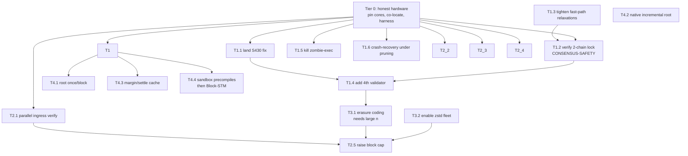

# Torus-hyperBFT — Performance & Correctness Roadmap to Hyperliquid Parity

**Author:** architecture review synthesis
**Status:** proposal for sequencing — not yet accepted
**Companion doc:** `Torus-hyperBFT-review.md` (full architecture + critical findings)

---

## 0. How to read this document

This is a single-file roadmap **plus** the detailed work packages ("PRPs" — Problem / Rationale / Plan) for each item. It is ordered so that **each tier is a prerequisite for the next**: you cannot trust a throughput number measured on a wedging chain, and you cannot trust a wedge fix measured on a starved CPU. The ordering is the deliverable — the individual ideas were already known to the project; what was missing is *which to do first and why*.

**Target (from the project's own goals + Hyperliquid's published numbers):**
- Blockspeed: ~289ms → ~70–100ms median time-to-commit
- Orders/s: ~11–35k measured → 200k end-to-end committed
- EVM: sustained throughput without state-root growth stalls

**Design stance for every item below — "best implementation quality" means:**
1. **Correctness is gated by a test that fails first (RED) and a determinism/oracle check that runs in CI**, not by a benchmark that looks good once.
2. **Every consensus-affecting change is either provably safe (written argument + model check) or explicitly proven to be node-local (cannot fork the chain).** We label each item **[LOCAL]** (proposer/node-local, cannot cause divergence), **[LOCKSTEP]** (changes the verify/consensus format — all validators must upgrade together), or **[CONSENSUS-SAFETY]** (touches the safety argument itself — requires proof before merge).
3. **No silent caps or truncation.** Any bound that drops work emits a metric.
4. **Measurement is done on isolated hardware** before any code conclusion is drawn (see Tier 0).
5. **One change per PR, each independently revertible**, behind a flag where the blast radius is the whole fleet.

---

## Tier 0 — Measure on honest hardware *(do before touching any code)*

> **Why first:** The project's own `ingress-cpu-supply.md` analysis is the most important finding in the entire performance history: the real per-action crypto cost is **~5.8ms**, but live runs measured ~70ms — a 12× inflation caused by **CPU starvation from co-resident processes** (a 100%-pinned MCP gateway, concurrent dev sessions) on a load-11 shared box. On paper there is already **~345k orders/s of ingress headroom**. Simultaneously, blockspeed is purely **RTT-bound** — there is no pacing floor in the code, so the 227–502ms inter-validator legs are pure geography. **A large fraction of the apparent gap is not in the code.** Any engineering done before isolating the environment optimizes against noise.

### T0.1 — Dedicated, pinned validator hardware [LOCAL]
- **Problem:** Benchmarks run on shared boxes with load ~11 from non-chain processes; verify/exec timings are contention-dominated.
- **Plan:** Provision one dedicated box per validator. Pin the node to isolated cores (`cpuset`/`taskset` — the runbook already exists, `ingress-cpu-supply.md` B1, and was never applied). Reserve cores for: consensus algorithm thread, execution thread, ingress rayon pool, libp2p. Move the MCP gateway / dev tooling off the validator boxes entirely.
- **Acceptance:** Re-run the bs100 / bs500 sweeps; `rpc_submit_verify_cpu_seconds` should approach the ~5.8ms/action floor with p99 within 2× of median (today it's 10×+). **No code merged in any later tier is measured until this passes.**
- **Effort:** ops, days. **Risk:** none. **Impact:** likely the single largest measured orders/s gain in the whole roadmap.

### T0.2 — Co-locate validators to cut RTT [LOCAL]
- **Problem:** ~70ms Hyperliquid blocks imply tightly-placed validators; Torus legs are 227–502ms.
- **Plan:** Place the validator set in one region (or a small set of low-RTT regions), as Hyperliquid does (Tokyo-centric). Keep archive/RPC nodes wherever users are.
- **Acceptance:** Measured inter-validator RTT < 50ms; empty-block cadence approaches the ~102ms local floor observed in S395.
- **Effort:** ops. **Risk:** centralization tradeoff (document it). **Impact:** this is what stands between ~289ms and ~70–100ms — it is physics, not code.

### T0.3 — Trustworthy measurement harness [LOCAL]
- **Problem:** Historical benches conflated endpoint-to-endpoint timing with committed cadence; the project already adopted a "least-squares slope over height samples, never endpoint-to-endpoint" rule (S405) — codify it.
- **Plan:** A single benchmark script that (a) pre-signs all actions before the measurement window, (b) reports committed-orders/s from chain state (not submit acks), (c) reports the dup-inclusion factor, (d) reports p50/p99 view duration by slope fit, (e) records the box's load average alongside every run and **refuses to report if load > 1.0 on a validator core**.
- **Acceptance:** Two back-to-back runs agree within 5%.
- **Effort:** small. **Risk:** none. **Impact:** every number in Tiers 1–4 depends on it.

---

## Tier 1 — Liveness & correctness *(a fast chain that wedges has zero throughput)*

> **Why second:** Under order-flood the chain currently has documented failure modes — the "body-miss death spiral," the epoch-boundary halt, and a consensus-safety question at the exact point where you'd add fault tolerance. Every throughput number in Tiers 2–4 is only meaningful if the chain stays live under that load. These are also the items where a mistake is *unrecoverable* (a fork or a permanent halt), so they get the most rigor.

### T1.1 — Land the S430 body-starvation fix (remove the diagnostic kill-switch) [LOCAL]
- **Problem:** The working tree's `request_missing_parent` (the fix for the header-first body-starvation livelock) is **disabled** by a guard marked `// TEMP-DIAGNOSTIC (S430 A/B): ... REMOVE`:
  ```rust
  if justify_view.int() != u64::MAX { return; }   // never false → fix is a no-op
  ```
  A body-starved validator that becomes leader burns a full view timeout on every leader slot (~84% failure under 8-way load in `parent_body_starvation_test`).
- **Rationale:** This is node-local (it only *adds* a by-hash parent fetch; it changes no wire format or vote). Pure liveness win, zero safety cost.
- **Plan:**
  1. Confirm what the A/B was isolating (read the S430 commit trail; the guard was added to bisect a regression — establish that regression is understood/resolved).
  2. Remove the guard.
  3. Keep the fetch-storm suppression that's already in the fix (don't re-fetch when the body is already parked in `deferred_bodies`).
- **Acceptance (RED-first):** `parent_body_starvation_test` fails with the guard present (starves within its 30s window), passes with it removed. `progress_and_validator_set_update` failure rate under 8-way load drops from ~84% to near 0. Zero `rc=134` (assert aborts).
- **Effort:** trivial code, careful verification. **Risk:** low. **Impact:** removes the worst load-induced stall. **Do this first in Tier 1.**

### T1.2 — Settle the 2-chain lock-depth question before growing the validator set [CONSENSUS-SAFETY]
- **Problem:** Torus forked the **3-chain** `hotstuff_rs`, cut the *commit* rule to 2-chain (`block_to_commit`, invariants.rs:518), but left the **3-chain grandparent lock** in place (`pc_to_lock(Generic) = justify.block.justify`, invariants.rs:434; `extends_locked_pc_block` checks to grandparent depth, invariants.rs:631). Production 2-chain protocols (HotStuff-2, Jolteon) lock **on the parent**. The project's own `specs/consensus/safety_arguments.md:207–233` reaches this exact spot and writes *"The formal gap here is whether an honest validator can commit C before seeing B's 2-chain. This is possible in async networks"* — then **defers to the MonadBFT paper** rather than closing it. This is **moot at today's 3-of-3 quorum (f=0)** but becomes load-bearing the moment a 4th validator makes f=1 — which is exactly the plan.
- **Rationale:** Two conflicting blocks committing is the worst possible bug (a fork). We do not want to discover the answer in production. This is not "the code is wrong" — MonadBFT (arXiv:2502.20692 Thm 1) claims lock-on-grandparent *is* sufficient for 2-chain; the question is whether *this implementation* faithfully matches that proof's locking depth and consecutive-views constraints.
- **Plan:**
  1. **Model-check it.** Write a Stateright (Rust, native to this codebase) or TLA+ model of exactly this protocol: 2-chain consecutive-views commit + grandparent lock + `safe_pc` predicate 3 + the header-first `safe_pc` relaxations (see T1.3). Drive n=4 (f=1) with an equivocating leader + partition/heal. Assert agreement (no two conflicting blocks committed) and check to a bounded depth.
  2. **If it holds:** capture the invariant the model relied on, write it as a `debug_assert` at the commit site, and document the mapping to MonadBFT Thm 1. Update `audit-scope.md` CONS-CHK-14 (which still says "chain of 3 certified blocks" — stale) to check *lock-depth-vs-commit-depth consistency*, the thing neither the checklist nor the 3.4.2 pass-note actually verified.
  3. **If it breaks:** change `pc_to_lock(Generic)` to lock on `justify` (lock-on-parent) and re-check. **Do not** re-add the third chain — that sacrifices the ~1-RTT finality latency the whole system is built around; lock-on-parent fixes it at zero latency cost.
- **Acceptance:** A model-checked agreement proof to bounded depth for n=4, committed to `specs/consensus/`, **before** T1.4 (4th validator) merges.
- **Effort:** medium-high (1–2 weeks for a careful model). **Risk of skipping:** catastrophic. **Impact:** unblocks fault tolerance safely.

### T1.3 — Tighten the header-first fast-path relaxations [CONSENSUS-SAFETY]
- **Problem:** The hybrid-pipelining path weakens three classical invariants (all confirmed in code): (a) replicas **vote before `app.validate_block`** runs (validation is deferred to body arrival); (b) `on_receive_proposal_header` **skips `safe_pc`** when the justify's block is already tracked as pending (implementation.rs:1653–1667); (c) **block-sync commits skip `safe_block`/`safe_pc`** entirely (client.rs:258–311), trusting "a valid QC chain is globally unique" — which is exactly the property T1.2 questions.
- **Rationale:** Each relaxation is individually defensible for liveness/latency, but they compound with T1.2 and with each other. They must be *in the model* of T1.2, not reasoned about informally.
- **Plan:**
  1. Include all three relaxations in the T1.2 model (they change the reachable state space).
  2. For (c) specifically: since sync trust depends on QC-chain uniqueness, and that's the crux of T1.2, make the sync-commit path's safety **explicitly conditional on the T1.2 outcome** — if the model needs lock-on-parent, the sync path inherits it.
  3. Add a metric for "voted on header later found app-invalid" so the vote-before-validate window's real-world frequency is observable.
- **Acceptance:** No relaxation is outside the checked model; the app-invalid-vote metric is wired.
- **Effort:** folds into T1.2. **Risk:** these are the areas where the recent livelocks surfaced — treat with care.

### T1.4 — Add a 4th validator (fault tolerance + fix the epoch halt trap) [LOCKSTEP]
- **Problem:** 3-of-3 quorum has **zero fault tolerance** (any node down = halt), and there's a documented **epoch-boundary quorum off-by-one**: with 3 equal stakes, epoch-change views need a quorum greater than any two validators, so the chain mechanically halts within ~100 views (one epoch) of losing any validator. The project's notes carry a standing rule: *do not change the validator set on the fleet-pinned binary* until the wrong-set-PC fix (771b063) ships.
- **Rationale:** f=1 is the minimum credible BFT posture. But this is the exact transition T1.2 must clear first.
- **Plan:** Gate on T1.2 (safety) and T1.1 (liveness) landing. Ship the wrong-set-PC fix to the whole fleet in lockstep. Add the 4th validator. Re-verify the epoch-boundary quorum math with n=4.
- **Acceptance:** Chain survives a single-validator kill+restart across an epoch boundary; no halt.
- **Effort:** ops + lockstep deploy. **Risk:** the ordering (must follow T1.2) is the whole point.

### T1.5 — Kill the zombie-execution failure mode [LOCAL]
- **Problem:** A panic in one market's matching thread (`market_workers.rs:77`, `h.join().expect("market worker panicked")`) kills the execution thread; consensus then keeps advancing height while every commit logs "execution pipeline channel closed — block will not be executed!" (app.rs:2071). **Height advances, state freezes** — the worst silent failure for a chain. Pervasive `.lock().unwrap()` on swarm/mempool paths makes lock-poisoning a realistic trigger.
- **Plan:**
  1. Catch per-market worker panics, convert to a typed error, and make the execution thread's death **halt consensus** (fail-stop) rather than let it zombie-advance. A node that cannot execute must stop producing/voting, not finalize un-executable blocks.
  2. Audit the `.unwrap()` on locks in the swarm loop and execution path; convert poisonings to fail-stop with a clear log, not silent thread death.
- **Acceptance:** Injected matching-engine panic causes a clean node halt with a diagnostic, **not** a height-advancing/state-frozen node. A test that poisons a market worker asserts the node stops finalizing.
- **Effort:** small-medium. **Risk:** low. **Impact:** converts a silent chain-corruption mode into a loud, recoverable crash.

### T1.6 — Fix the latent crash-recovery skip under pruning [LOCAL]
- **Problem:** `find_last_committed_height` (app.rs:156) reads only the last key of `cf_block_headers`, but the pruner stores its progress meta key in the **same CF** (pruner.rs:78) and it sorts after all realistic height keys — so once pruning has run, the function returns `None` and crash-recovery replay (app.rs:1169) is silently skipped.
- **Plan:** Move the pruner meta key to `cf_consensus_meta` (or any CF not scanned for max-height), or make `find_last_committed_height` explicitly skip non-height keys. Add a crash-recovery test **with pruning enabled**.
- **Acceptance:** Kill a pruning node mid-block; on restart it replays the gap correctly (today it doesn't).
- **Effort:** small. **Risk:** low. **Impact:** correctness under the default archive-off config.

---

## Tier 2 — Orders/s: raise the ceiling toward 20k orders/block

> **Why third:** 200k orders/s ÷ ~10 blk/s = **20k orders/block**. The batching keystone (O2, `PlaceOrderBatch` — one ecrecover per 1024 orders) already shipped and gave ~38× (293 → 11.2k orders/s). The remaining ceiling is set by (a) a serial ingress verifier, (b) a conservative block cap that's coupled to (c) body dissemination bandwidth. These are ordered so the cap is only raised once dissemination can carry it — otherwise you re-create the historical bs1000 wedge.

### T2.1 — Parallelize gossip-ingest signature verification [LOCAL]
- **Problem:** `add_native_action_from_gossip` (main.rs:513 → mempool lib.rs:385) runs **one serial ecrecover per action on a single tokio task** on the consensus/libp2p runtime — a hard **~10k action/s single-core ceiling** per validator, and it competes with consensus.
- **Rationale:** Node-local, and the safety backstop already exists: the exec thread re-verifies every signature post-commit and **slashes+tombstones** the proposer on any invalid sig (app.rs:337). So ingress can afford to be optimistic.
- **Plan:**
  1. Route gossip-ingest verification through the **dedicated ingress rayon pool** (the one already sized `cores/2` and isolated to avoid starving consensus — `ingress-verify-fix` proved a *shared* pool regresses, block time 529→4034ms; a dedicated pool is the fix).
  2. Batch-verify (ed25519 batch API for session keys; parallel secp256k1 recover for EIP-712).
  3. Dedup against the verified-sender trust cache **before** recovering.
- **Acceptance:** Gossip-ingest verify throughput scales with the ingress pool's core count; consensus view duration under flood does not regress (this is the trap from `ingress-verify-fix` s352 — the acceptance test must assert no consensus starvation). Slashing test still fires on an injected bad sig.
- **Effort:** medium. **Risk:** medium (the starvation trap is real — hence the dedicated-pool requirement and the explicit no-regress gate). **Impact:** removes the per-node ingest wall.

### T2.2 — Batch the per-action DA write on ingress [LOCAL]
- **Problem:** `mirror_to_da` (mempool lib.rs:604) does one RocksDB `put` **per action on the RPC ingress path**. The proposer path already batches into one `WriteBatch`; ingress didn't get the same treatment.
- **Plan:** Accumulate ingress DA mirrors over a ~50ms window (or N actions) into a single `WriteBatch`, matching the proposer path.
- **Acceptance:** RocksDB write ops/action on ingress drop ~N×; no increase in body-miss rate (bodies still durable before the action can be selected).
- **Effort:** small. **Risk:** low. **Impact:** removes ingress write amplification.

### T2.3 — Incremental native-pool ordering [LOCAL]
- **Problem:** `select_native_for_block` sorts the **entire** native pool (≤65,536 entries) and rebuilds the hash index **on every `produce_block`**, under the pool write lock, contending with RPC/gossip inserts (native_pool.rs:283–295).
- **Plan:** Maintain a sorted index incrementally (a `BTreeMap` keyed by `(is_cancel, sender, nonce)`), so selection is a bounded scan, not a full re-sort. Take a snapshot to select outside the write lock.
- **Acceptance:** `block_build_seconds` no longer grows with pool depth; ingress insert latency under load drops (no longer blocked behind a full sort).
- **Effort:** medium. **Risk:** low (proposer-local; determinism gate: same selection as the sort-based version for identical pool state). **Impact:** removes a proposer-critical-path O(n log n) and a lock-contention hotspot.

### T2.4 — Eliminate the canonical-identity re-serialization tax [LOCKSTEP-sensitive]
- **Problem:** Even the binary ingress endpoint re-serializes each action to **serde_json** to compute the keccak action-hash (torus.rs:298), because the action-identity is *defined* as keccak of canonical serde_json bytes. That definition is consensus-critical (all nodes must agree on the hash), so it can't be changed casually.
- **Plan:** Cache the canonical bytes alongside the action from the moment it's first decoded, so the hash is computed once and the bytes are reused for DA/gossip/forward rather than re-serialized at each hop. **Do not** change the hash definition (that's a lockstep chain-format change with a migration); just stop recomputing it.
- **Acceptance:** Action-hash is computed exactly once per action end-to-end; a determinism test confirms the cached-bytes hash is byte-identical to the recomputed one across every path (this is the existing `bincode_roundtrip_preserves_action_hash`-style gate, extended).
- **Effort:** medium. **Risk:** medium (touches the identity path — the determinism gate is mandatory). **Impact:** cuts CPU and allocation on the hottest ingress path.

### T2.5 — Raise `NATIVE_TOTAL_BLOCK_CAP` toward 20k-orders/block — *gated on T3.1* [LOCAL]
- **Problem:** `NATIVE_TOTAL_BLOCK_CAP = 100` actions/block. With max batches (1024 orders each) that's already 102k order-slots, but the **byte cap** (6MB ≈ 40k orders) and **dissemination** are the real limits. The cap is deliberately conservative — it's the WAN dissemination guard, and raising it alone re-creates the historical bs1000 wedge.
- **Rationale:** This is a knob, not code — but it's the knob that turns dissemination capacity into orders/s. It must move *with* T3.1 (erasure coding), never ahead of it.
- **Plan:** After T3.1 lands, sweep the cap upward on devnet with the T0.3 harness, watching the body-miss rate and view-duration p99. Move `VERIFIED_SENDER_CACHE_CAP` (currently sized against cap=100) up in proportion, or it thrashes.
- **Acceptance:** Cap raised to the level dissemination can carry with body-miss rate < 1% and no view-timeout wedges over a sustained flood. **No silent drop:** log every selection-cap and byte-cap truncation.
- **Effort:** small (knob) but gated. **Risk:** high if done before T3.1. **Impact:** directly scales orders/block.

---

## Tier 3 — Dissemination scale: the structural throughput multiplier

> **Why fourth:** Once ingress and block caps are unblocked, the binding constraint becomes **bytes across the validator mesh**. The 6MB/block byte cap ≈ 40k orders is a hard ceiling. zstd is already shipped (9.4× on bodies). The remaining multiplier — the one Hyperliquid's throughput implies and Torus **parked** — is erasure coding. This tier has a hard dependency on Tier 1.4 (validator count), because erasure coding barely pays off at n=3.

### T3.1 — Erasure-coded body dissemination [LOCKSTEP]
- **Problem:** Body dissemination is single-source-ish (pull from the proposer), which the s338 storm exposed (155 pull timeouts + 238 substream exhaustions to one peer). Per-link bytes scale with body size, not with validator count.
- **Rationale — and the honest caveat:** Polkadot-style RS(k,n) custody makes per-link bytes ≈ body/k. **But at n=3, k=2 this is only ~0.5× per-link + hotspot removal** — barely worth the complexity. The 5–15× headline requires a large set: **n=21 ⇒ per-link ~0.14×.** So this item is only worth building *after* the validator set grows (T1.4 and beyond). Build it, but don't expect the multiplier until the set is large.
- **Plan (phased, from the parked `sprint5-erasure-coding` design):**
  1. Recovery-path first: erasure-code bodies for the *pull-fallback* path (the storm site), so a lagging node reconstructs from any k shards instead of hammering one peer. `reed-solomon-erasure` (or `-simd`).
  2. Erasure-root + per-shard Merkle proofs (verify-then-reconstruct, **not** reconstruct-then-verify — one bad shard shouldn't force combinatorial retry). Body-hash backstop.
  3. `< k` shards available → fall back to whole-body pull (never wedges).
  4. Ingress dispersal (validators custody shards at admission) as a later phase.
- **Acceptance:** A single-source pull storm is impossible (load spreads across the set); reconstruction proven from exactly k shards; a corrupt shard is rejected by proof, not by retry; whole-body fallback verified. Determinism: erasure-root placement decided (header field ⇒ requires a genesis relaunch — plan it).
- **Effort:** large. **Risk:** medium-high (new consensus-adjacent format; lockstep). **Impact:** the structural lever that makes 200k feasible at scale — *but only once n is large.*

### T3.2 — Enable the shipped zstd body protocols on the fleet [LOCKSTEP]
- **Problem:** The `/torus/{direct,native-da,block-data}/2.0` zstd protocols are **built and measured (9.4× on bodies, level 3)** but the gossip flip (`--gossip-zstd`) is off pending a full-fleet upgrade, and mixed-version fallback must be verified.
- **Plan:** Coordinate a fleet upgrade; flip zstd on the request/response paths first (multistream-select negotiates per-peer, so it's mixed-version-safe by construction), then the gossip topic once all validators carry it.
- **Acceptance:** Measured on-wire body bytes drop ~9× with zero peer bans in a mixed-version window (the existing zstd-bomb/corruption tests remain green).
- **Effort:** small (code done) + lockstep ops. **Risk:** low (negotiated). **Impact:** free ~9× on the byte ceiling — do this early in Tier 3, it's already built.

---

## Tier 4 — Execution: the last mile (where Hyperliquid itself is bottlenecked)

> **Why last:** Hyperliquid states **execution**, not consensus, is their bottleneck at 200k. Torus's own S395 exec decomposition agrees: matching is cheap (~98ms/20k orders) but **margin (~727ms) and settlement (~1699ms) dominate**. This is the regime you only reach *after* Tiers 0–3 — but it's ultimately where 200k is won or lost.

### T4.1 — Compute the EVM state root once per block [LOCAL]
- **Problem:** The state root is computed **up to three times per EVM block** on the live path: once in `validate_block_for_catchup` and **discarded** (state_root.rs:43), once at commit (incremental.rs:359), once more in `resync_evm_accounts` for native fee credits (app.rs:470).
- **Rationale:** Cheapest large EVM win in the whole roadmap. Node-local.
- **Plan:** Plumb the first computation's `TrieUpdates` into the commit `WriteBatch` (compute once, commit once). Skip the root entirely in `validate_block_for_catchup` when `skip_state_root_check` is set (it's only fed to a histogram there). Fold the fee-credit resync into the main commit so it doesn't trigger a third `StateRoot` run.
- **Acceptance:** `torus_state_root_compute_seconds` fires **once** per EVM block on the live path; the incremental==full-scan oracle still passes in CI.
- **Effort:** medium. **Risk:** low (behind the existing determinism oracle). **Impact:** removes ~2/3 of state-root cost per block.

### T4.2 — Incremental native state root (A2 / "O6") [LOCKSTEP]
- **Problem:** The EVM half (A1) is done and **proven flat (3.19ms @1M accounts vs 6.98s full-scan)**. The native half is still a full keccak over 6 CFs, ~200ms/block at 1M native entries (×2/block) — "the last unbounded-growth term on the hot path."
- **Plan:** Ship the designed bucketed-Merkle native root (65,536 buckets, 16-bit prefix, keccak-ordered mirror CF) with the same determinism doctrine as A1: full-scan oracle in CI, delete-to-default discipline, crash/reopen survival, `four_node_consensus` green with the oracle on.
- **Acceptance:** Native root time flat vs state size (target ~1–6ms); zero oracle divergence over ≥10k blocks; genesis/migration plan for the flat→bucketed transition (it's a binary-format change ⇒ coordinated relaunch).
- **Effort:** large. **Risk:** medium (consensus-critical determinism; the A1 oracle discipline is the model to follow). **Impact:** removes the last O(state) hot-path term — required for sub-100ms *at scale*.

### T4.3 — Margin & settlement caching [LOCAL]
- **Problem:** Margin (~13µs/order) and settlement dominate the exec phase. The O1 write-back balance cache showed **~29% shaved in micro-bench** (1177→831µs/400-order batch) but isn't live.
- **Plan:** Land the write-back per-`execute_batch` balance cache (write-through was measured null — it's the per-order overlay PUT that costs, not reads). Flush-and-evict before each `apply_fill` for realized-PnL coherence; flush all in sorted-address order at call end.
- **Acceptance:** Live `exec_phase_margin_seconds` A/B shows the micro-bench win holds under real load; the stale-cache detector test stays green.
- **Effort:** medium (code exists). **Risk:** low. **Impact:** ~1.6× orders/s on the exec-bound axis.

### T4.4 — Sandbox the writer precompiles → unblock parallel EVM execution [CONSENSUS-SAFETY / LOCAL]
- **Problem:** Torus cross-VM writer precompiles (CoreWriter, order-book, staking) mutate RocksDB **directly during EVM execution** (precompiles.rs:270), not through revm's journal. An EVM tx that calls a writer precompile and then **reverts** leaves a durable write behind — revm can't undo it. This is both a **correctness bug** (revert doesn't revert) and **blocker #1 for Block-STM-style parallel execution** (optimistic re-execution would double-apply).
- **Plan:**
  1. Virtualize the writer precompiles into a **journaled overlay** with commit-on-success semantics (extend the existing "native overlay everywhere" direction into the EVM precompile path). A reverted tx discards its precompile writes.
  2. Once side effects are journaled and revertible, evaluate Block-STM: optimistic per-tx `State` instances, multi-version memory spanning native CFs (reader precompiles read native state), read/write-set validation, ordered merge, beneficiary special-casing.
- **Acceptance:** A revert test proves a writer-precompile write is undone on revert (fixes the correctness bug regardless of parallelism). Then, if parallel execution is pursued: identical state root vs sequential execution over a large chaos workload.
- **Effort:** the journaling is medium; Block-STM is large. **Risk:** high for the parallel part. **Impact:** fixes a real correctness bug *now*, and is the only path to parallel execution *later* — but only pays off once the gas budget rises toward the 30M block limit (today's 5M selection budget makes serial execution adequate). **Sequence the journaling fix early (correctness); defer Block-STM until the gas budget is the binding constraint.**

---

## Dependency graph (the ordering *is* the deliverable)



**Critical path to the two headline numbers:**
- **~70–100ms blocks:** T0.1 + T0.2 (hardware/RTT) → T1.1 (no load stalls) → T4.1/T4.2 (root cost off the hot path at scale). *Most of this is Tier 0.*
- **200k orders/s:** T0.1 (CPU) → T2.1 (ingress) → T3.2 + T3.1 (dissemination bytes) → T2.5 (raise cap) → T4.3/T4.4 (execution). *Gated end-to-end on T1 staying live.*

---

## What I deliberately did NOT put on this roadmap

- **Re-adding the third chain.** It sacrifices the ~1-RTT finality latency the system is built around. If T1.2 finds a gap, the fix is lock-on-parent, not a third round.
- **Speculative block production** (the parked `speculative-pipelining` PRP). It's a real latency lever (~15→10ms) but it sits *on top of* the header-first relaxations that T1.2/T1.3 are still validating. Revisit only after the safety model is settled — adding more speculative surface before then increases the state space you have to prove safe.
- **Chasing per-action crypto micro-optimization.** The project already falsified this (`ingress-cpu-supply` B4): the real cost is ~5.8ms and the inflation is contention. Tier 0 addresses the actual cause.

---

## One-paragraph executive summary

The architecture is already correct and matches Hyperliquid's (2-chain MonadBFT, commit-then-execute, hash-only proposals, one-signature batching). The gap to parity is, in order: **(0) run on isolated, co-located hardware** — this alone closes a large fraction of both gaps and must precede any measurement; **(1) make the chain survive load** by landing the disabled S430 fix, settling the 2-chain lock-depth safety question *before* adding fault tolerance, and killing the zombie-execution mode; **(2) unblock ingress** with parallel verification and incremental pool ordering; **(3) scale dissemination** by enabling the already-built zstd protocols and building erasure coding (which only pays off once the validator set is large); and **(4) grind execution** — compute the state root once, finish the incremental native root, cache margin/settlement, and journal the writer precompiles (a correctness fix that also unblocks eventual parallel execution). No consensus redesign is required. The single highest-leverage action is Tier 0, and the single most important *not-yet-answered* question is T1.2.
